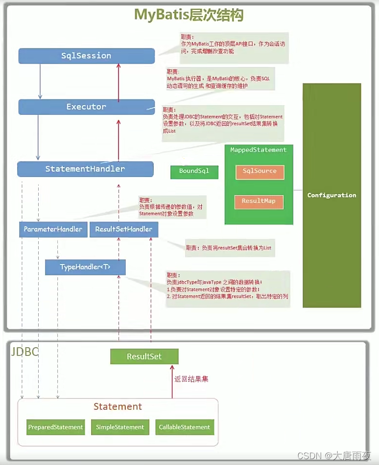

# MyBatis

---

## 基础部分

---

### foreach

根据 foreach 元素的属性，重新拼接成完整的 SQL。

支持 List、Array、Map 三种类型遍历。

List 类型示例：

```
<select id="countByUserList" resultType="_int" parameterType="list">
select count(*) from users
  <where>
    id in
    <foreach item="item" collection="list" separator="," open="(" close=")" index="">
      #{item.id, jdbcType=NUMERIC}
    </foreach>
  </where>
</select>
```

### 缓存

当开启缓存后，数据的查询执行的流程：二级缓存 -> 一级缓存 -> 数据库。

建议 MyBatis 缓存特性在生产环境中进行关闭，单纯作为一个 ORM 框架使用可能更为合适。

### 一级缓存

一级缓存的生命周期和 SqlSession 一致。

一级缓存内部设计简单，只是一个没有容量限定的 HashMap，在缓存的功能性上有所欠缺。

一级缓存最大范围是 SqlSession 内部。

有多个 SqlSession 或者分布式的环境下，数据库写操作会引起脏数据，建议设定缓存级别为 Statement。

### 一级缓存的缓存级别

SESSION 级别：在一个 MyBatis 会话中执行的所有语句，都会共享这一个缓存。

STATEMENT 级别：缓存只对当前执行的这一个 Statement 有效。

### 二级缓存

命名空间全局缓存：实现了 SqlSession 之间缓存数据的共享。

**优点：**

相对于一级缓存来说，粒度更加的细，能够到 namespace 级别，

通过 Cache 接口实现类不同的组合，对 Cache 的可控性也更强。

**缺点：**

在多表查询时，极大可能会出现脏数据，有设计上的缺陷，安全使用二级缓存的条件比较苛刻。

分布式环境下必然会出现读取到脏数据，需要使用集中式缓存将 MyBatis 的 Cache 接口实现，有一定的开发成本，直接使用 Redis、Memcached 等分布式缓存可能成本更低，安全性也更高。


---

## 常见问题

---

### 插入主键冲突

ON DUPLICATE KEY UPDATE

### 批量插入

insert into VALUES

### 自增主键的回显

设置回显之后，会注入到传入的对象中。

### foreach 对象的大小要大于零

foreach 对象要在代码中判空和判断大小。

---

## 提高部分

---

### MyBatis 重要组件

Configuration：MyBatis 所有的配置信息都保存在 Configuration 对象之中，配置文件中的大部分配置都会存储到该类中

SqlSession：作为 MyBatis 工作的主要顶层 API，表示和数据库交互时的会话，完成必要数据库增删改查功能

Executor：MyBatis 执行器，是 MyBatis 调度的核心，负责 SQL 语句的生成和查询缓存的维护

StatementHandler：封装了 JDBC Statement 操作，负责对 JDBC statement 的操作，如设置参数等

ParameterHandler：负责对用户传递的参数转换成 JDBC Statement 所对应的数据类型

ResultSetHandler：负责将 JDBC 返回的 ResultSet 结果集对象转换成 List 类型的集合

TypeHandler：负责 java 数据类型和 jdbc 数据类型 (也可以说是数据表列类型) 之间的映射和转换

MappedStatement：MappedStatement 维护一条 <select|update|delete|insert> 节点的封装

SqlSource：负责根据用户传递的 parameterObject，动态地生成 SQL 语句，将信息封装到 BoundSql 对象中，并返回

BoundSql：表示动态生成的 SQL 语句以及相应的参数信息

### MyBatis 层次结构




---


---

参考链接：

- [Mybatis 层次结构与执行流程](https://blog.csdn.net/LIZHONGPING00/article/details/123887586)
- [聊聊 MyBatis 缓存机制](https://tech.meituan.com/2018/01/19/mybatis-cache.html)
- []()
- []()

---


